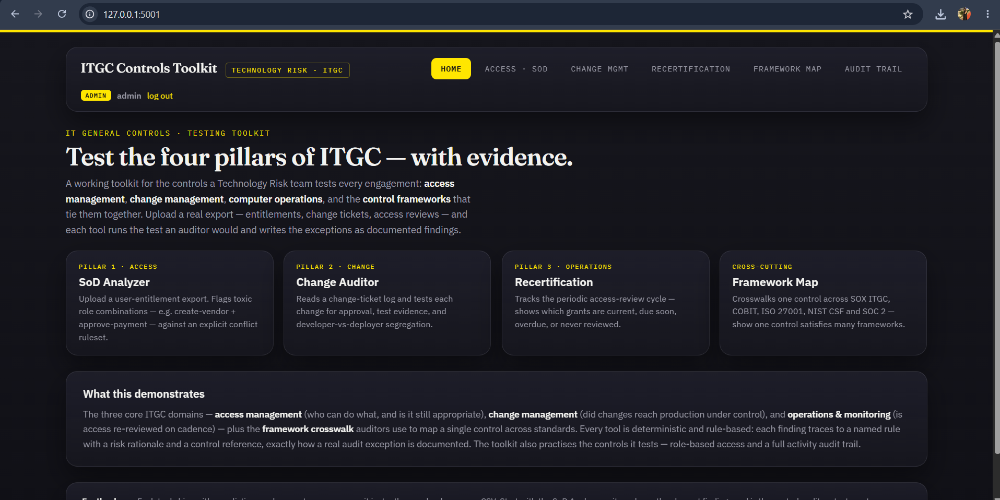
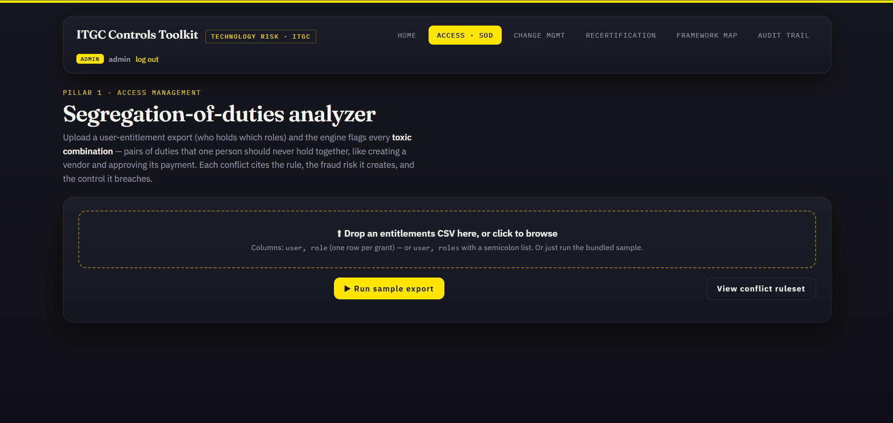
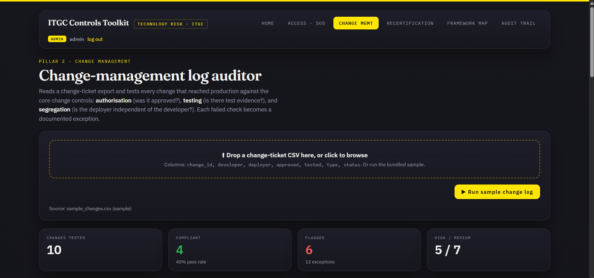
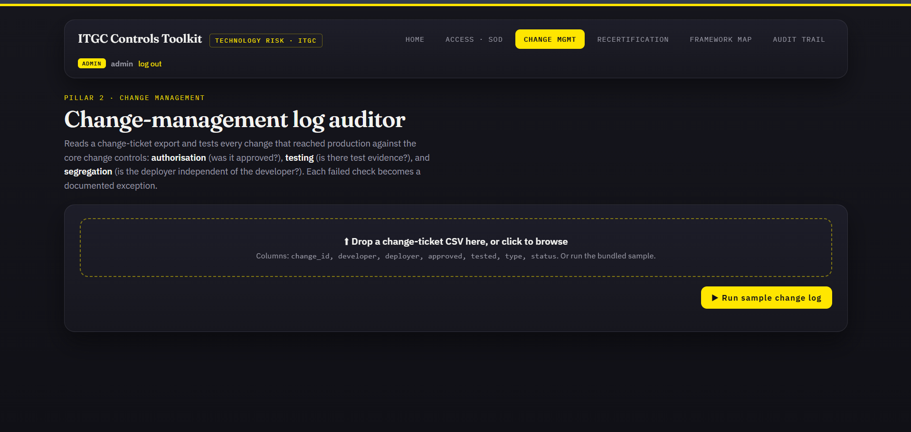

# ITGC Controls Toolkit

> A working toolkit that tests **IT General Controls (ITGC)** the way an audit team does — across access, change, and operations — and documents every finding as a traceable exception.


---

## Overview

Most projects *describe* IT general controls. This one **runs the tests**.

The ITGC Controls Toolkit ingests the same exports a real IT auditor works from — user-entitlement lists, change-ticket logs, access-review records — and tests them against the three core ITGC domains: **access management**, **change management**, and **operations & monitoring**. Every finding traces back to a named rule with a risk rationale and a control reference, exactly the way an audit exception is documented.

It was built as a companion to an equity risk-modelling dashboard: where that project is about *model risk*, this one is about the *IT general controls* every automated control and system-generated number in the financial statements depends on.

<!-- 📸 Add a screenshot of the home page here -->


---

## What it tests — the four pillars

| Tool | ITGC domain | What it tests |
|------|-------------|---------------|
| **SoD Analyzer** | Access management | Toxic role combinations one person should never hold (e.g. create-vendor + approve-payment) |
| **Change Auditor** | Change management | Whether each change had approval, test evidence, and developer-vs-deployer segregation |
| **Recertification Tracker** | Operations & monitoring | Whether access is re-reviewed on cadence — current, due, overdue, or never reviewed |
| **Framework Map** | Cross-cutting | One control mapped across SOX ITGC, COBIT 2019, ISO 27001:2022, NIST CSF 2.0 and SOC 2 |

Every engine is **deterministic and rule-based** — there's no black-box model. Each finding cites the exact rule it broke, why it matters, and the control it maps to, so the results are explainable and audit-defensible.

---

## Sample findings

Each tool ships with a realistic synthetic export, so the toolkit produces meaningful findings the moment you run it. On the bundled sample data:

- **SoD Analyzer** — flags **8 conflicts across 8 users**, 5 of them high-severity, including a user who can both create a vendor and approve payments.
- **Change Auditor** — reports a **40% change-compliance rate** (4 clean changes out of 10), surfacing unapproved changes, missing test evidence, and self-deployed changes.
- **Recertification Tracker** — finds **6 of 10 access grants at risk**, split across due-soon, overdue, and never-reviewed.
- **Framework Map** — crosswalks any control across five major frameworks to show how one control satisfies many standards.

> A detail worth noticing: the findings cross-reference each other. The same user flagged by the SoD Analyzer (develop + deploy access) reappears in the Change Auditor for self-deploying a change — the same root cause seen from two control angles.

<!-- 📸 Add screenshots of the SoD Analyzer and Change Auditor results here -->



---

## The toolkit practises the controls it tests

This isn't just a set of tests — it's built like a controlled system:

- **Role-based access** — three roles (`admin`, `auditor`, `viewer`) enforced server-side, so a viewer can read findings but can't run or upload.
- **Activity audit trail** — every login, run, and upload is logged with user and timestamp.

In other words, the application models the very access and logging controls it evaluates.

<!-- 📸 Optionally add a screenshot of the activity audit trail here -->


---

## Tech stack

- **Backend:** Python + Flask
- **Storage:** SQLite (users, activity log, run history)
- **Frontend:** vanilla HTML / CSS / JS (no build step)
- **Analysis engines:** pure-Python, deterministic, rule-based

---

## Quick start

```bash
# from the project root
cd backend
python -m venv venv
venv\Scripts\activate          # Windows
# source venv/bin/activate     # macOS / Linux
pip install -r requirements.txt
python app.py
```

Then open **http://localhost:5001** and sign in.

| Role | Username | Password |
|------|----------|----------|
| Admin (full access) | `admin` | `admin123` |
| Auditor | `auditor` | `auditor123` |
| Viewer (read-only) | `viewer` | `viewer123` |

Each tool has a **Run sample** button to demo instantly, or you can upload your own CSV in the same schema as the bundled samples.

---

## Project structure

```
itgc-toolkit/
├── backend/
│   ├── app.py                 # Flask app: auth, endpoints, upload, audit log
│   ├── services/              # the four analysis engines + db helpers
│   ├── data/                  # sample CSV exports
│   └── uploads/               # user-uploaded CSVs (gitignored)
├── frontend/                  # HTML pages + static assets
├── Dockerfile
└── README.md
```

---

## Sample data

The bundled exports live in `backend/data/`:

- `sample_entitlements.csv` — user-to-role mapping for the SoD Analyzer
- `sample_changes.csv` — change-ticket log for the Change Auditor
- `sample_recert.csv` — access grants with last-review dates for the Recertification Tracker

All sample data is **synthetic** — the users and records are invented purely to demonstrate the tests.

---

## Notes

Built as a learning and portfolio project to demonstrate IT general controls testing end to end. It runs locally and operates on synthetic sample data; it is not a production audit system and contains no real or client data.
